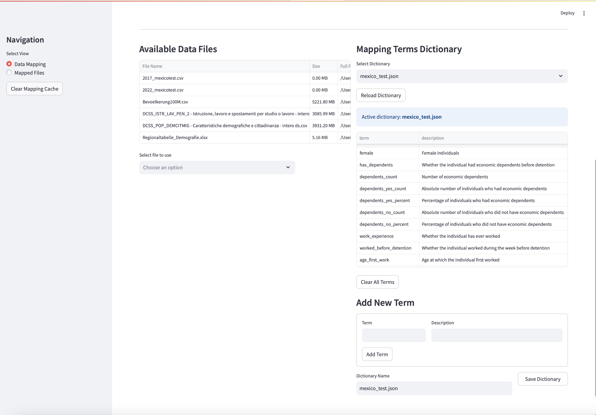
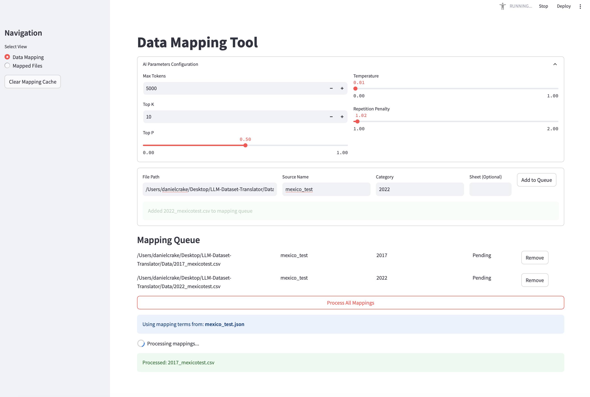
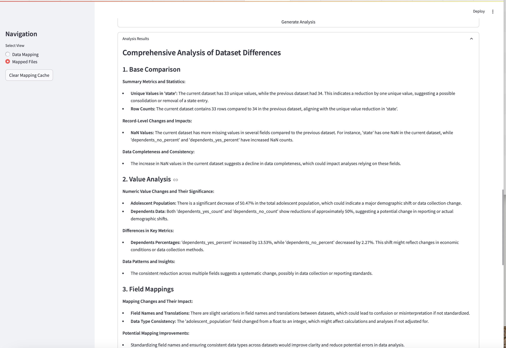

# LLM-DATASET-TRANSLATOR

A powerful AI-assisted tool for mapping, translating, and comparing dataset schemas across different formats and structures.

## Purpose

LLM-DATASET-TRANSLATOR leverages Large Language Models to automate the tedious process of data mapping between different schemas. It helps you:

- Automatically map columns from source datasets to standardized terms
- Create, manage, and reuse mapping dictionaries for different data domains
- Compare datasets to identify structural and value differences
- Generate AI-powered analysis of dataset differences

This tool is designed for data engineers, analysts, and researchers who frequently work with datasets from different sources that need to be normalized to a common schema.

## Application Structure

The application consists of two main views:

1. **Data Mapping**: Where you can map new datasets using AI assistance
2. **Mapped Files**: Where you can view, edit, and compare previously mapped files

The core components include:

- AI-powered mapping engine that suggests field mappings
- Mapping dictionary management system
- File comparison tools with AI-assisted analysis
- Data file browser and management

## Installation and Setup

### Prerequisites

- Python 3.8+
- pip package manager

### Setup Steps

1. Clone the repository:
   ```bash
   git clone https://github.com/your-username/LLM-DATASET-TRANSLATOR.git
   cd LLM-DATASET-TRANSLATOR
   ```

2. Install the required dependencies:
   ```bash
   pip install -r requirements.txt
   ```

3. Configure your OpenAI API key:
   - Create a `.streamlit/secrets.toml` file with the following structure:
     ```toml
     [llm_credentials]
     openai_api_key = "your-api-key-here"
     ```

4. Create the necessary directories if they don't exist:
   ```bash
   mkdir -p Data mappedFiles metadata
   ```

5. Run the Streamlit application:
   ```bash
   streamlit run streamlit-app.py
   ```

## How to Use

### Mapping a New Dataset

1. **Start in Data Mapping view**: This is the default view when you open the application.
2. **Select a Dictionary**: Choose or create a mapping terms dictionary that matches your data domain.
3. **Select Source Data**: Either use the file selector at the bottom left to choose a file from the Data directory, or manually enter a file path.
4. **Enter Dataset Metadata**:
   - Source Name: A name for the data source (e.g., "Census", "Financial_Records")
   - Category: A category or grouping for the data (e.g., "2023", "Q1", "Europe")
   - Sheet (Optional): If using an Excel file, specify which sheet to use
5. **Add to Queue**: Click "Add to Queue" to add the file to the processing queue
6. **Process Mappings**: Click "Process All Mappings" to start the AI-assisted mapping process - Configs for the LLM can be selected within the app for conditions like Temperature, Top P and Top K.
7. **Review Results**: After processing, the mapped files will be saved to the mappedFiles directory

### Viewing and Comparing Mapped Files

1. **Switch to Mapped Files view**: Use the radio button in the sidebar
2. **Select File(s)**: Choose one or two mapped files to view or compare
3. **Edit Mappings**: Make manual adjustments to the mappings if needed
4. **Save As**: Save modified mappings with a new suffix
5. **Compare Files**: When two files are selected, you can compare their structure and content
6. **Generate Analysis**: For file comparisons, you can generate an AI-powered analysis of the differences

### Managing Mapping Dictionaries

1. **Access Dictionary Editor**: Located in the bottom right of the Data Mapping view
2. **Create New Dictionary**: Start with a blank dictionary and add terms
3. **Edit Existing Dictionary**: Select a dictionary from the dropdown and add/modify terms
4. **Save Dictionary**: Name and save your dictionary for future use

## File Structure

```
LLM-DATASET-TRANSLATOR/
├── .streamlit/                  # Streamlit configuration
│   └── secrets.toml             # API credentials (not in repo)
├── Data/                        # Source data files
├── mappedFiles/                 # Output directory for mapped files
├── metadata/                    # Mapping dictionaries and metadata
├── utils/                       # Utility modules
│   ├── comparison_analyser.py   # AI analysis of file comparisons
│   ├── data_comparison.py       # Core comparison functionality
│   ├── data_processing.py       # Data processing utilities
│   ├── LLMCompare.py            # DataFrame comparison tools
│   ├── LLMPydantic.py           # Mapping processor with Pydantic models
│   └── openai_client.py         # OpenAI API client
└── streamlit-app.py             # Main application file
```

## Key Features

### AI-Powered Mapping

- Automatically identifies and suggests mappings for dataset columns
- Adapts to different data structures and naming conventions
- Learns from your mapping patterns over time

### Mapping Dictionaries

- Create domain-specific dictionaries of standard terms
- Reuse dictionaries across multiple datasets
- Manage and edit dictionaries through the UI

### File Comparison

- Compare mapped files to identify structural differences
- Analyze value changes between dataset versions
- Generate comprehensive reports on data differences

### AI Analysis

- Get natural language explanations of dataset differences
- Identify potential data quality issues
- Receive suggestions for mapping improvements

## Troubleshooting

### Common Issues

- **API Key Errors**: Ensure your OpenAI API key is correctly set in `.streamlit/secrets.toml`
- **File Not Found**: Check that your data files are in the correct directory (Data/)
- **Mapping Errors**: For complex files, try specifying the sheet name explicitly
- **Out of Memory**: For very large files, consider splitting them into smaller chunks

### Getting Help

If you encounter issues not covered here, please open an issue on the GitHub repository with:
- A description of the problem
- Steps to reproduce
- Any error messages you received

## Contributing

Contributions are welcome! Please feel free to submit a Pull Request.

1. Fork the repository
2. Create your feature branch (`git checkout -b feature/AmazingFeature`)
3. Commit your changes (`git commit -m 'Add some AmazingFeature'`)
4. Push to the branch (`git push origin feature/AmazingFeature`)
5. Open a Pull Request

## An Example

## Example Use Case: Analyzing Mexican Juvenile Justice System Data

The following example demonstrates how LLM-DATASET-TRANSLATOR can be used to standardize, map, and analyze government data across different time periods.

### Dataset Background

For this example, we used data from Mexico's National Institute of Statistics and Geography (INEGI) on adolescents in the juvenile justice system. The datasets included:

- A 2017 survey on adolescents in the justice system
- A 2022 follow-up survey with similar but not identical structure
- Both datasets contain information about demographics, economic dependents, work history, and other characteristics

Data source: [INEGI Open Data Portal](https://en.www.inegi.org.mx/datosabiertos/)

### Step 1: Creating a Specialized Mapping Dictionary

First, we created a specialized dictionary for the Mexican justice system data:

1. In the Data Mapping view, we went to the Mapping Terms Dictionary section
2. Created a new dictionary named "mexico_test.json"
3. Added standardized terms relevant to juvenile justice data:
   - `state` - For Mexican states (Entidad federativa)
   - `has_dependents` - Whether the adolescent had economic dependents
   - `dependents_yes_count` - Absolute number with dependents
   - `dependents_yes_percent` - Percentage with dependents
   - `dependents_no_count` - Absolute number without dependents 
   - `dependents_no_percent` - Percentage without dependents
   - `work_experience` - Employment history
   - Additional terms for demographics, family situation, etc.

This dictionary standardized Spanish column names across datasets that used different naming conventions.



### Step 2: Processing the Data Files

After creating the dictionary, we processed the files:

1. Added the 2017 and 2022 dataset files to the Data directory
2. In the Data Mapping view, specified:
   - File Path: Path to each dataset CSV
   - Source Name: "mexico_test" (consistent naming for related files)
   - Category: "2017" and "2022" respectively (to distinguish time periods)
3. Added both files to the mapping queue
4. Clicked "Process All Mappings" with the mexico_test.json dictionary active

The system used AI to:
- Identify Spanish column names in both datasets
- Map them to our standardized terms
- Create structured mapping files for both datasets



### Step 3: Comparing the Datasets

After processing, we compared the datasets:

1. Switched to the Mapped Files view
2. Selected both processed files for comparison
3. Chose "dependents_yes_percent" and other relevant fields as key identifiers
4. Ran the comparison
5. Generated an AI analysis of the differences

### Step 4: Analysis Insights



### Benefits Demonstrated

This example showcases how the tool enabled:

1. **Standardization** across differently structured Spanish-language datasets
2. **Automated Mapping** of complex demographic data
3. **Systematic Comparison** of justice system statistics across time periods
4. **AI-Powered Analysis** to identify significant changes and data issues